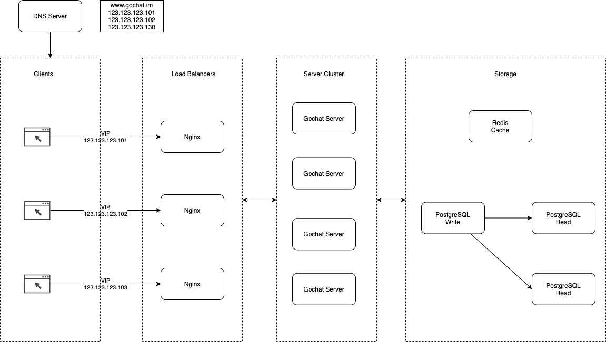

# Distributed Go Chat

## Why this project?

I'm growing interest in building highly concurrent distributed web applications that can serve millions of users. There are so many technologies and resources. I think the best way to learn them is by building something so that I will be able to use them when needed.

## Target

Functional requirements:

- User register, login.
- One to one chat room.
- Deliver messages in real time.
- Restore chat history when a conversation starts.

Non functional requirements:

- Easy horizontal scaling in the server layer.

## High Level Design

This is the high level design that I am trying to achieve.

## Resources

### gPRC

[Official Language Guide of protocol buffers](proto3)(https://developers.google.com/protocol-buffers/docs/proto3): You should always check the official document first.

[Protobuf Uber V1 Style Guide](https://github.com/uber/prototool/blob/dev/etc/style/uber1/uber1.proto): Google provides a [Style Guide](https://developers.google.com/protocol-buffers/docs/style). But I think Uber's is easier to follow.

gRPC [Quick Start](https://grpc.io/docs/languages/go/quickstart/) & [Basics tutorial](https://grpc.io/docs/languages/go/basics/): Hands-on exercise with gRPC.

[Go Generated Code](https://developers.google.com/protocol-buffers/docs/reference/go-generated): I was quite confused with the `protoc` and how to manage generated code at first. But after reading this doc, things become much more clear.

[Error Handling](https://avi.im/grpc-errors/#go): It contains sample code about using `status` and `codes` in client and server.

### Websocket

### System Design

[A high level design of distributed systems](https://youtu.be/iJLL-KPqBpM?t=360).

### TCP/IP

Although it's not directly related, I found that getting a better understanding of TCP/IP protocols helps to understand web technologies much better.

[TCP/IP Guide](http://tcpipguide.com/free/t_toc.htm): I highly recommend this book. It covers everything I need to understand how the Internet works in a very easy to understand way.

TCP Fundamentals - Wireshark Talks at Sharkfest [Part 1](https://www.youtube.com/watch?v=xdQ9sgpkrX8&t=1989s&ab_channel=ChrisGreer) & [Part 2](https://www.youtube.com/watch?v=NdvWI6RH1eo&ab_channel=ChrisGreer): Seeing how the packages are passed around the network really helps me a lot to understand things I read from the book. The lecturer has some hands-on courses on Pluralsight. Very high quality. You can find them in the description of his videos.